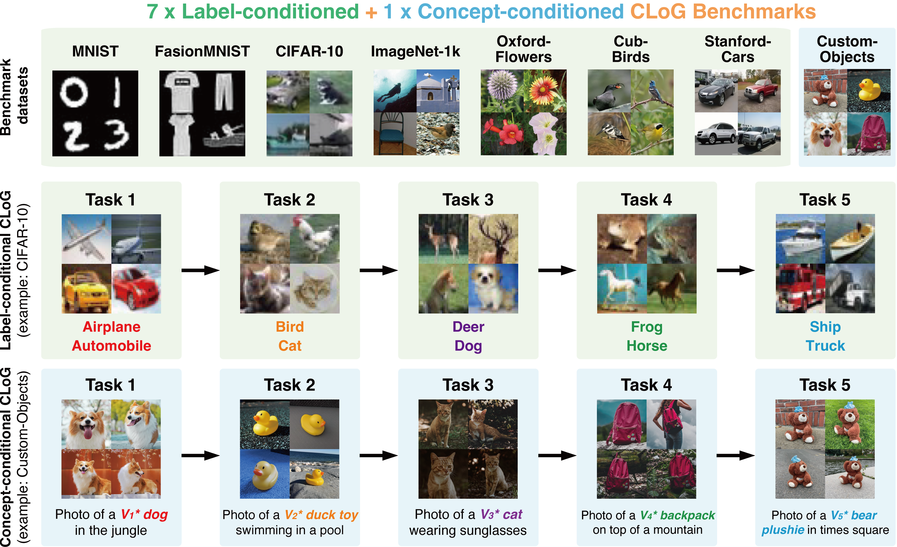
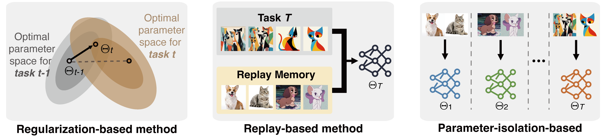

<p align="center">
  <a href="https://github.com/linhaowei1/CLoG">
    
  </a>
</p>

<div align="center">

 | [日本語](docs/README_JP.md) | [English](https://github.com/linhaowei1/CLoG) | [中文简体](docs/README_CN.md) | [中文繁體](docs/README_TW.md) |

</div>


---
<p align="center">
Code and data for paper <a href="https://arxiv.org/pdf/2406.04584">CLoG: Benchmarking Continual Learning of Image Generation Models</a>
    </br>
    </br>
    <a href="https://www.python.org/">
        
    </a>
    <a href="https://huggingface.co/docs/diffusers">
        
    </a>
    <a>
        
    </a>
</p>


## 📰 News
* **[Jun. 7, 2024]**: We launch the first version of code for *label-conditioned CLoG*. Our codebase is still in development, please stay tuned for the comprehensive version.
* **[Aug. 22, 2024]**: Optimized version of CoLG. At this stage, the main improvements involve refining the original code's workflow and removing redundant parts, including the integration of training and testing, dataset construction, and testing scripts. In this version, testing is no longer performed after the completion of all tasks; instead, each task is tested immediately after it is completed, followed by testing the current and previous tasks, with all relevant metrics saved. However, this version still has four major drawbacks: (1) The training scripts for various methods and the GAN components are missing. (2) The testing process does not follow class-guided generation but instead follows task-based generation, which means the obtained metrics are not strictly accurate. (3) There is an issue with the sample process in the C-LoRA method; the task ID should not be directly accessed but rather inferred through various means to obtain a pseudo-task ID. (4) The training process of C-LoRA aligns with Few-shot Class Incremental Learning, where pretraining is done on the first task, followed by LoRA fine-tuning on subsequent tasks. This approach is suitable for few-shot scenarios but not for LoRA-based methods, which should ideally use a pretrained model on a large dataset. This approach should now be referred to as the Few-shot C-LoRA setting.

<!--
## 👋 Overview
We advocates for shifting the research focus from classification-based continual learning (CL) to **continual learning of generative models (CLoG)**. Our codebase adapts 12 existing CL methodologies of three types—replay-based, regularization-based, and parameter-isolation-based methods—to generative tasks and introduce 8 benchmarks for CLoG that feature great diversity and broad task coverage. 




-->

## 🚀 Set Up
To run CLoG from source, follow these steps:
1. Clone this repository locally
2. `cd` into the repository.
3. Run `conda env create -f environment.yml` to created a conda environment named `CLoG`.
4. Activate the environment with `conda activate CLoG`.

<!--
## 💽 Usage
Coming soon! For the time being, you can check `scripts/cifar-naive.sh` for running NCL on CIFAR-10.

## 💫 Contributions
We would love to hear from the CL community, broader machine learning, and generative AI communities, and we welcome any contributions, pull requests, or issues!
To do so, please either file a new pull request or issue. We'll be sure to follow up shortly!
-->

## ✍️ Citation
If you find our work helpful, please use the following citations.
```
@article{
    zhang2024clog,
    title={CLoG: Benchmarking Continual Learning of Image Generation Models},
    author={Haotian Zhang and Junting Zhou and Haowei Lin and Hang Ye and Jianhua Zhu and Zihao Wang and Liangcai Gao and Yizhou Wang and Yitao Liang},
    booktitle={arxiv},
    year={2024}
}
```

## 🪪 License
MIT. Check `LICENSE.md`.
